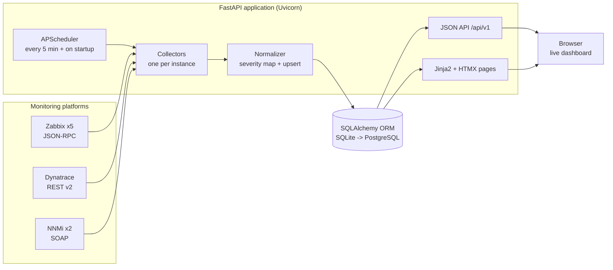
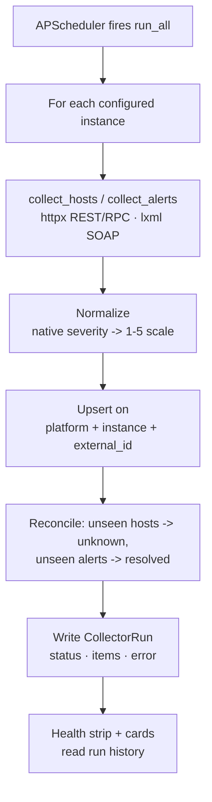

# Architecture & Technology

How the Unified Monitoring Dashboard is built, what technology it uses, and how
the pieces fit together. For setup and operation, see [`README.md`](README.md).

---

## 1. What it is

A FastAPI service that polls **Zabbix**, **Dynatrace**, and **NNMi** on a
schedule, normalizes their hosts and alerts into one shared data model, and
serves a live HTMX dashboard. It runs locally (SQLite) today and moves to an
internal server (PostgreSQL) with no code changes.

- **Platforms unified:** 3 (Zabbix, Dynatrace, NNMi)
- **Server instances:** many per platform (currently 5 Zabbix + 1 Dynatrace + 2 NNMi)
- **Wire protocols:** JSON-RPC 2.0, REST v2, SOAP
- **Frontend build steps:** 0

---

## 2. Technology stack

| Layer | Technology | Role |
| --- | --- | --- |
| **Runtime** | Python 3.12, venv | Language & isolated environment |
| **Web / API** | FastAPI, Uvicorn (ASGI), Starlette, Pydantic v2 | Routing, server, request/response schemas |
| **Data** | SQLAlchemy 2.x ORM, SQLite → PostgreSQL | Persistence (same code, two databases) |
| **Scheduling** | APScheduler | Background interval polling + startup run |
| **Config** | pydantic-settings (`.env`), PyYAML (`servers.yaml`) | Behavior settings + server inventory |
| **Collection** | httpx (REST/RPC), lxml (SOAP/XML), smtplib (test mail) | Talking to each platform |
| **Protocols** | JSON-RPC 2.0 (Zabbix), REST v2 (Dynatrace), SOAP (NNMi) | Platform APIs |
| **Frontend** | Jinja2, HTMX, vanilla CSS (variables, `conic-gradient` charts), `theme.js` | Server-rendered live UI, dark mode, no build step |
| **Tooling** | Git / GitHub, WSL / Windows 11, Python Install Manager | Development & delivery |

No JavaScript framework, no bundler, no CSS framework. HTMX is vendored locally
so the UI has no runtime CDN dependency.

---

## 3. System architecture

Collectors **write**; the web layer only **reads**. One platform being down
never blocks another or the UI.



### Project layout

```
app/
├── main.py            FastAPI app, startup, scheduler wiring
├── config.py          pydantic-settings (.env)
├── servers.py         servers.yaml loader (ServerConfig)
├── db.py              engine, session, Base
├── models.py          Host, Alert, CollectorRun
├── schemas.py         pydantic API schemas
├── normalizer.py      severity maps + upsert / reconcile
├── scheduler.py       APScheduler + per-instance status
├── collectors/
│   ├── base.py        BaseCollector (timing, upsert, run record)
│   ├── zabbix.py      JSON-RPC, proxies, SMTP test mail
│   ├── dynatrace.py   Entities v2 + Problems v2 (403-graceful)
│   ├── nnmi.py        SOAP (NodeBean / IncidentBean)
│   └── mock_data.py   MOCK_MODE fixtures (per instance)
├── routers/           pages.py (HTML + HTMX) · api.py (/api/v1)
├── templates/         Jinja2 (base, overview, hosts, alerts, partials/)
└── static/            style.css, theme.js, htmx.min.js (vendored)
```

---

## 4. The collection pipeline

Every instance runs the same lifecycle. Records are keyed on
`(source_platform, source_instance, external_id)`, so the same host id on two
Zabbix servers never collides, and anything missing from a run is reconciled
(not deleted).



A collector failure is caught, logged, and recorded on `CollectorRun` (the run
is marked `failed`); other instances continue unaffected.

---

## 5. Platform integrations

Each platform speaks a different protocol and authenticates differently. Every
collector hides that behind one contract: `collect_hosts()` and
`collect_alerts()` returning normalized dicts.

### Zabbix — JSON-RPC 2.0
- **Auth:** API token *or* `user.login` with username/password (tries both
  `username` and `user` keys for version compatibility).
- **Hosts:** `host.get`; availability read from the **interface** (Zabbix 6.0+),
  falling back to the host-level field.
- **Alerts:** `trigger.get` for currently-firing triggers.
- **Proxies:** `proxy.get` — for instances flagged `check_proxies`, summarizes
  "N/M online" (names any offline proxies) on the instance card.
- **Test mail:** reads the Email media type's SMTP settings (`mediatype.get`)
  and sends through that relay via `smtplib` (none / STARTTLS / SSL). The
  JSON-RPC API has no media-type test method on any version.
- **Robustness:** a plain-HTTP server reached over `https://` (SSL
  `WRONG_VERSION_NUMBER`) is auto-retried over `http://`.

### Dynatrace — REST v2
- **Auth:** `Authorization: Api-Token <token>` header.
- **Hosts:** Entities v2, `entitySelector=type("HOST")`, paged via `nextPageKey`.
- **Alerts:** Problems v2. If the token lacks `problems.read`, the 403 is handled
  gracefully — the alerts feed is marked *unavailable* and collection continues.

### NNMi — SOAP
- **Auth:** HTTP Basic; the account needs the **Web Service Clients** role.
- **Nodes:** `NodeBeanService/NodeBean`, namespace `node.sdk.nms.ov.hp.com`.
- **Incidents:** `IncidentBeanService/IncidentBean` — open, severity ≥ warning.
- **Envelope:** a `filt:expression` `arg0` carrying `offset` / `maxObjects` /
  a condition, empty `SOAPAction`, services at the **server root** (the `/nnm`
  console path is stripped). Parsed with lxml, skipping nested `<item>` lists.

---

## 6. Unified data model

Three ORM tables absorb every platform. `source_instance` is what makes
multiple servers per platform work.

| Table | Key fields | Purpose |
| --- | --- | --- |
| `Host` | hostname, ip, source_platform, **source_instance**, external_id, status (up/down/unknown), group_name, last_seen, raw_payload | One monitored host, normalized. |
| `Alert` | external_id, source_platform, **source_instance**, host_hostname, severity_int (1–5), severity_label, title, started_at, resolved, raw_payload | An alert/problem/incident on a shared severity scale. |
| `CollectorRun` | platform, instance, started_at, finished_at, status, items_collected, error_message | Health history — drives the collector dots. |

**Severity normalization** (`normalizer.py`): Zabbix priority 0–5 → 1–5 (0/1 both
→ 1); Dynatrace `severityLevel` (AVAILABILITY/ERROR → 5 … INFO → 1); NNMi
CRITICAL → 5 … NORMAL/INFO → 1.

---

## 7. Web & UI layer

- **Server-rendered** with Jinja2; **HTMX** swaps fragments — the overview and
  alerts poll every 60s, hosts has live search / filter / sort. No JS framework.
- **Charts** without a library: the severity donut is a CSS `conic-gradient`;
  per-platform up/down bars are proportional-width divs.
- **Dark mode**: CSS variables + a no-flash inline bootstrap in `<head>`, toggled
  and persisted by `theme.js`.
- The 60s UI refresh reads only the **local database** — it never touches the
  monitoring systems. Only the 5-minute background poll contacts them.

### JSON API (`/api/v1`)

| Method & path | Purpose |
| --- | --- |
| `GET /hosts` | Hosts (filters: `platform`, `status`, `q`). |
| `GET /alerts?active=true` | Alerts; `active=true` hides resolved. |
| `GET /summary` | Aggregate KPIs. |
| `GET /collectors/status` | Per-instance health. |
| `POST /collectors/run` | Run every instance now. |
| `POST /collectors/{instance}/run` | Run one instance. |
| `POST /collectors/{instance}/test-mail?to=` | Zabbix SMTP test mail. |

---

## 8. Engineering journey

Each obstacle was diagnosed from a real error and fixed in code or config.

1. **Scaffold the POC** — FastAPI + SQLAlchemy + APScheduler + Jinja/HTMX with a
   `MOCK_MODE` so the whole UI could be built before any VPN access.
2. **Run on Windows** — WSL had no network route, so we ran natively on Windows.
   Python 3.14 tried to compile `pydantic-core` (needing Rust, blocked by the
   corporate TLS proxy); **Python 3.12** ships prebuilt wheels and fixed it.
3. **Many servers per platform** — introduced `servers.yaml` + a `source_instance`
   column with per-instance reconciliation. (A one-space YAML indentation error
   was the first live hurdle.)
4. **Zabbix without tokens** — `user.login` with username/password; host status
   read from the interface (6.0+).
5. **The plain-HTTP server** — one instance served HTTP on `:8443`
   (`SSL: WRONG_VERSION_NUMBER`); the client now auto-retries over `http://`.
6. **Cracking NNMi** — the first attempt 403'd (wrong namespace + `/nnm` path);
   the collector now follows the NNMi SDK contract (correct namespaces,
   `filt:expression` envelope, empty SOAPAction, server root).
7. **Test mail, the real way** — no API method exists, so read the Zabbix Email
   media type's SMTP settings and send via `smtplib`.
8. **Fresh data on every start** — the startup collection now fires on every
   startup (in the background) via `next_run_time`, not just on an empty DB.

---

## 9. Deployment notes

- **Database:** switch `DATABASE_URL` to PostgreSQL (`postgresql+psycopg://…`) and
  `pip install "psycopg[binary]"` — no code changes; tables auto-create on start.
- **Process:** run under systemd with **one Uvicorn worker** — the APScheduler
  poller lives in-process, so multiple workers would each poll in parallel. Put
  Nginx/Apache in front for TLS. See `README.md` for the systemd unit.
- **Secrets:** credentials live only in `.env` and `servers.yaml`, both gitignored.
